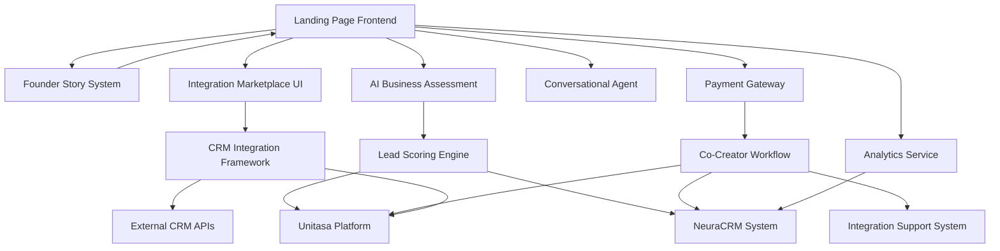

# Design Document

## Overview

The Landing Page and Onboarding System is a conversion-focused web application that positions Unitasa as an AI Marketing Automation Platform with plug-and-play CRM integrations, built by a founder who automated lead generation from zero. The system showcases NeuraCRM as the default built-in CRM while highlighting seamless connectivity to major CRMs (Pipedrive, Zoho, HubSpot, Monday, Salesforce). The platform offers an exclusive co-creator program (25 seats) with lifetime access and integration support, demonstrating automation capabilities through the user experience itself.

## Architecture

### High-Level Architecture



### Technology Stack

- **Frontend**: React.js with responsive design framework (Tailwind CSS)
- **Backend**: FastAPI (existing infrastructure)
- **Database**: PostgreSQL (existing NeuraCRM backend)
- **Payment Processing**: Stripe API with PayPal fallback
- **Conversational AI**: OpenAI GPT-4 with custom knowledge base
- **Analytics**: Google Analytics 4 + custom event tracking
- **Deployment**: Railway (existing infrastructure)

## Components and Interfaces

### 1. Landing Page Frontend

**Purpose**: Position Unitasa as AI Marketing Automation Platform with comprehensive CRM integration capabilities

**Key Components**:
- Hero Section positioning Unitasa as AI Marketing Automation Platform
- Integration Marketplace showcase with major CRM logos and connection status
- NeuraCRM as default built-in option with "or connect your existing CRM"
- Founder transformation story from zero to automated lead generation
- Co-creator program presentation (25 seats) with integration support benefits
- Real-time integration demos and one-click connection examples
- Mobile-first responsive design with CRM integration focus

**API Interfaces**:
```typescript
interface LandingPageAPI {
  getFounderStory(): Promise<FounderStoryContent>
  getCoCreatorStatus(): Promise<CoCreatorProgramStatus>
  getSupportedCRMs(): Promise<CRMIntegration[]>
  submitLeadCapture(leadData: LeadCaptureForm): Promise<LeadResponse>
  trackPageView(pageData: PageViewEvent): Promise<void>
  initializeChat(): Promise<ChatSession>
}

interface CoCreatorProgramStatus {
  seatsRemaining: number
  totalSeats: number
  urgencyLevel: 'high' | 'medium' | 'low'
}

interface CRMIntegration {
  name: string
  logo: string
  status: 'available' | 'coming_soon' | 'beta'
  setupComplexity: 'easy' | 'medium' | 'advanced'
  features: string[]
}
```

### 2. AI Business Readiness Assessment Engine

**Purpose**: Evaluate current CRM setup and marketing automation readiness with specific integration recommendations

**Key Components**:
- Current CRM system identification and capability assessment
- Marketing automation gap analysis
- Integration complexity evaluation
- Technical readiness scoring
- Personalized CRM integration roadmap

**Data Models**:
```typescript
interface CRMAssessmentQuestion {
  id: string
  text: string
  integrationInsight: string
  type: 'multiple_choice' | 'scale' | 'text' | 'crm_selector'
  options?: string[]
  weight: number
  category: 'current_crm' | 'data_quality' | 'automation_gaps' | 'technical_readiness'
}

interface AssessmentResponse {
  questionId: string
  answer: string | number
  selectedCRM?: string
  timestamp: Date
  integrationInsightViewed: boolean
}

interface CRMAssessmentResult {
  leadId: string
  currentCRM: string
  integrationScore: number
  readinessLevel: 'nurture_with_guides' | 'co_creator_qualified' | 'priority_integration'
  integrationRecommendations: string[]
  automationOpportunities: string[]
  technicalRequirements: string[]
  nextSteps: string[]
}
```

### 3. Lead Scoring Engine

**Purpose**: Evaluate CRM integration readiness and qualify for co-creator program

**Scoring Algorithm**:
- Current CRM system and data quality (30%)
- Marketing automation gaps and opportunities (25%)
- Technical integration readiness (25%)
- Investment capacity and implementation timeline (20%)

**Segmentation Logic**:
- 0-40% (Cold): Nurture with CRM integration guides and free resources
- 41-70% (Warm): Co-creator program qualification with integration support
- 71-100% (Hot): Priority onboarding with direct integration assistance

### 4. Conversational Agent

**Purpose**: Real-time visitor assistance and guidance

**Key Features**:
- Natural language processing for visitor queries
- Context-aware responses about NeuraCRM/Unitasa
- Assessment guidance and support
- Voice-to-text capability
- Handoff to human support when needed

**Integration Points**:
- OpenAI GPT-4 API for conversation handling
- Custom knowledge base with product information
- Lead capture integration for qualified conversations
- Analytics tracking for conversation metrics

### 5. Payment Gateway Integration

**Purpose**: Process $250 Founding Users program payments with exclusive benefits activation

**Payment Flow**:
1. Qualified prospect views Founding Users program benefits
2. Real-time seat availability check (25 seats maximum)
3. Payment form with exclusive program details
4. Secure payment processing with immediate benefits activation
5. Founding Users onboarding trigger with lifetime access provisioning

**Security Considerations**:
- PCI DSS compliance through Stripe
- SSL encryption for all payment data
- Webhook verification for payment confirmations
- Fraud detection and prevention
- Seat availability concurrency control

### 6. Founding Users Workflow Engine

**Purpose**: Exclusive onboarding with lifetime access, roadmap influence, and supporter recognition

**Workflow Steps**:
1. Payment confirmation and seat allocation
2. Lifetime access provisioning with special privileges
3. Roadmap influence system activation
4. Welcome sequence with founder recognition
5. Supporter badge and testimonial opt-in
6. Priority support channel assignment

**Integration with Unitasa Agents**:
- Exclusive Founding Users communication sequences
- Roadmap update notifications
- Feature voting reminders
- Success story collection automation
- Priority demo scheduling

### 8. Integration Marketplace

**Purpose**: Showcase CRM integration capabilities with 2-click connection setup

**Key Components**:
- Visual CRM integration gallery with logos and status
- One-click connection demos and setup wizards
- Integration complexity indicators and setup time estimates
- Feature comparison matrix for different CRMs
- Real-time connection status and health monitoring

**Supported CRMs (MVP)**:
- Pipedrive (REST API, OAuth2, excellent documentation)
- Zoho CRM (REST API, Python/Node SDKs, free dev accounts)
- HubSpot (REST API, Webhooks, widespread adoption)
- Monday.com (GraphQL API, modern design)
- Salesforce (REST API, enterprise features)

**Data Models**:
```typescript
interface CRMConnector {
  id: string
  name: string
  logo: string
  apiType: 'REST' | 'GraphQL' | 'SOAP'
  authMethod: 'OAuth2' | 'API_Key' | 'JWT'
  setupComplexity: 'easy' | 'medium' | 'advanced'
  setupTimeMinutes: number
  features: CRMFeature[]
  status: 'available' | 'beta' | 'coming_soon'
  documentation: string
  sdkAvailable: boolean
}

interface CRMFeature {
  name: string
  supported: boolean
  description: string
  apiEndpoint?: string
}
```

### 9. CRM Integration Framework

**Purpose**: Standard REST API-based integration system with secure authentication and data sync

**Key Components**:
- OAuth2 and API key authentication handlers
- Core object mapping (Contacts, Companies, Deals, Activities)
- Field mapping configuration interface
- Custom sync intervals and error logging
- Webhook and polling support for real-time sync

**Integration Architecture**:
```typescript
interface IntegrationConfig {
  crmType: string
  authConfig: {
    method: 'oauth2' | 'api_key'
    credentials: Record<string, string>
    refreshToken?: string
  }
  fieldMapping: FieldMapping[]
  syncInterval: number
  webhookUrl?: string
  errorLogging: boolean
}

interface FieldMapping {
  autoMarkField: string
  crmField: string
  dataType: 'string' | 'number' | 'date' | 'boolean'
  required: boolean
  transformation?: string
}

interface SyncResult {
  success: boolean
  recordsProcessed: number
  errors: SyncError[]
  lastSyncTime: Date
  nextSyncTime: Date
}
```

### 10. Founder Story System

**Purpose**: Showcase the founder's transformation journey with emphasis on CRM integration challenges and solutions

**Key Components**:
- Interactive timeline highlighting CRM integration milestones
- Before/after metrics showing lead generation improvement
- Technology stack evolution with CRM integration focus
- Integration challenges overcome and solutions implemented
- Vision for unified AI marketing automation

**Content Elements**:
- "From Disconnected Tools to Unified Automation" narrative
- CRM integration success stories and metrics
- Technical decisions and their business impact
- Integration challenges and breakthrough moments
- Future vision for seamless CRM connectivity

**Data Models**:
```typescript
interface FounderMilestone {
  id: string
  date: Date
  title: string
  description: string
  metrics: {
    leadsGenerated?: number
    crmIntegrations?: number
    automationLevel?: number
    timesSaved?: number
  }
  technologies: string[]
  integrationChallenges: string[]
  lessonLearned: string
}

interface FounderStoryContent {
  heroNarrative: string
  milestones: FounderMilestone[]
  currentMetrics: {
    totalLeadsAutomated: number
    crmsIntegrated: number
    businessesEnabled: number
    integrationHours: number
  }
  vision: string
}
```

### 7. Roadmap Influence System

**Purpose**: Enable Founding Users to influence product development and maintain engagement

**Key Features**:
- Feature suggestion submission portal
- Voting system for proposed features
- Development priority transparency
- Founding Users feedback integration
- Recognition for implemented suggestions

**Data Models**:
```typescript
interface FeatureSuggestion {
  id: string
  foundingUserId: string
  title: string
  description: string
  votes: number
  status: 'submitted' | 'under_review' | 'planned' | 'in_development' | 'completed'
  submittedAt: Date
}

interface FoundingUserProfile {
  id: string
  userId: string
  joinedAt: Date
  lifetimeAccess: boolean
  supporterBadge: boolean
  featuresInfluenced: string[]
  testimonialOptIn: boolean
}
```

## Data Models

### Lead Management

```sql
CREATE TABLE leads (
    id UUID PRIMARY KEY,
    email VARCHAR(255) UNIQUE NOT NULL,
    name VARCHAR(255) NOT NULL,
    business_description TEXT,
    phone VARCHAR(50),
    linkedin_profile VARCHAR(255),
    created_at TIMESTAMP DEFAULT NOW(),
    updated_at TIMESTAMP DEFAULT NOW()
);

CREATE TABLE assessments (
    id UUID PRIMARY KEY,
    lead_id UUID REFERENCES leads(id),
    responses JSONB NOT NULL,
    score INTEGER NOT NULL,
    category VARCHAR(50) NOT NULL,
    insights TEXT[],
    completed_at TIMESTAMP DEFAULT NOW()
);

CREATE TABLE payments (
    id UUID PRIMARY KEY,
    lead_id UUID REFERENCES leads(id),
    amount DECIMAL(10,2) NOT NULL,
    currency VARCHAR(3) DEFAULT 'USD',
    stripe_payment_id VARCHAR(255),
    status VARCHAR(50) NOT NULL,
    processed_at TIMESTAMP DEFAULT NOW()
);
```

### Analytics Tracking

```sql
CREATE TABLE page_views (
    id UUID PRIMARY KEY,
    session_id VARCHAR(255),
    page_path VARCHAR(255),
    referrer VARCHAR(255),
    user_agent TEXT,
    created_at TIMESTAMP DEFAULT NOW()
);

CREATE TABLE conversion_events (
    id UUID PRIMARY KEY,
    lead_id UUID REFERENCES leads(id),
    event_type VARCHAR(100) NOT NULL,
    event_data JSONB,
    created_at TIMESTAMP DEFAULT NOW()
);
```

## Error Handling

### Frontend Error Handling
- Form validation with real-time feedback
- Network error recovery with retry mechanisms
- Graceful degradation for JavaScript disabled users
- Payment failure handling with clear messaging

### Backend Error Handling
- API rate limiting and throttling
- Database connection pooling and failover
- Payment webhook retry logic
- Comprehensive logging and monitoring

### User Experience Considerations
- Loading states for all async operations
- Clear error messages with actionable guidance
- Fallback options for failed integrations
- Progressive enhancement for core functionality

## Testing Strategy

### Unit Testing
- Component testing for React components
- API endpoint testing for FastAPI routes
- Scoring algorithm validation
- Payment processing logic testing

### Integration Testing
- End-to-end assessment flow
- Payment gateway integration
- Email/notification delivery
- CRM data synchronization

### Performance Testing
- Page load speed optimization
- Mobile responsiveness validation
- Database query performance
- Payment processing latency

### Security Testing
- Payment data handling validation
- SQL injection prevention
- XSS protection verification
- Authentication and authorization testing

## Deployment and Monitoring

### Deployment Strategy
- Staged deployment through Railway
- Feature flags for gradual rollout
- Database migration scripts
- Environment-specific configurations

### Monitoring and Analytics
- Real-time conversion tracking
- Performance monitoring with alerts
- Error tracking and reporting
- Weekly analytics reports

### Success Metrics
- Landing page engagement with CRM integration showcase (target: 65% scroll depth)
- CRM Assessment completion rate (target: 80%)
- Co-creator program conversion rate (target: 35%)
- Seat fill rate for 25 co-creators (target: 100% within 45 days)
- CRM integration demo interaction rate (target: 50%)
- Integration documentation access rate (target: 60% of qualified leads)
- Successful CRM connection rate post-purchase (target: 90%)
